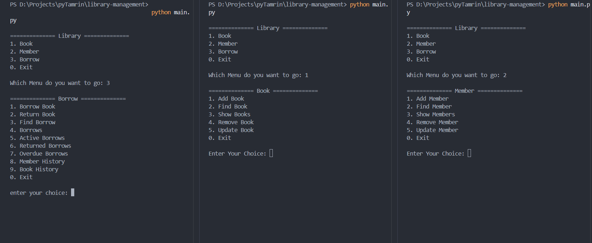
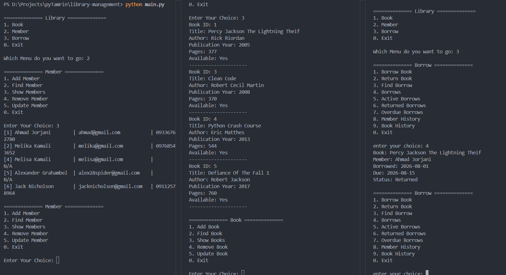

# Library Management

A simple command-line Library Management  built with Python, Pydantic and SQLite.

## Preview



## Features
- Add, Remove, Update, Find, Show books
- Add, Remove, Update, Find, Show members
- Borrow Book
- Return Book
- Member History
- Book History

## Technologies

- Python 3
- SQLite3
- Pydantic

## Project Structure

```text
library-managment/
│
├── images/
│   └── demo.png
├── models/
│   └── book.py
│   └── member.py
│   └── borrow.py
├── ui/
│   └── books.py
│   └── members.py
│   └── borrows.py
├── main.py
├── library.py
├── database.py
├── library.db
├── README.md
├── mistakes.md
└── .gitignore
```

## How to Run

```bash
pip install pydantic
pip install pydantic[email]

python main.py
```

## Example

```
1. Add Book
2. Update Book
3. Add Member
4. Borrow Book
5. Return Book
...
```

## What I Practiced

- Object-Oriented Programming (OOP)
- SQLite CRUD Operations
- Pydantic
- Exception Handling
- Separation of Concerns
- Basic Project Architecture